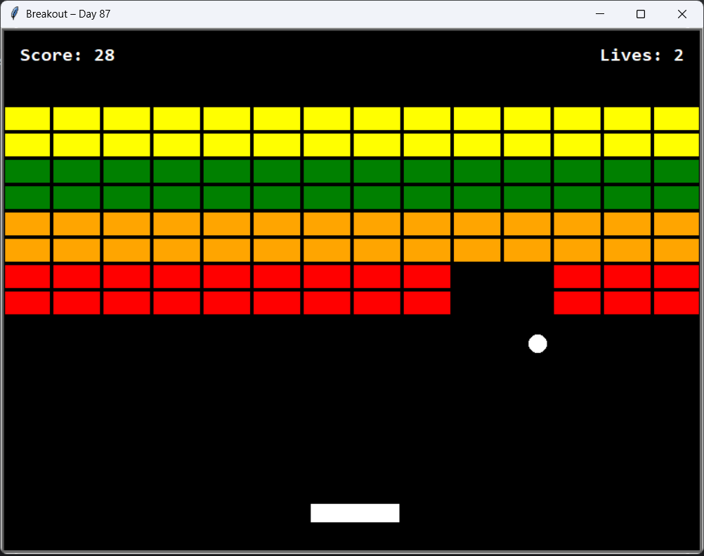

# Breakout Game – Day 87

Classic Atari 1976 Breakout clone built with Python's **turtle** module during Dr. Angela Yu's 100 Days of Code Python Bootcamp.

## Features
- Smooth paddle control (Arrow keys)
- Realistic angled bounces based on paddle hit position
- Color-coded bricks with different point values
- Lives system (3 lives) + auto-launch after 2 seconds
- Progressive difficulty (ball speeds up as bricks decrease)
- Clean **Object-Oriented Design**:
  - `GameObject` base class with AABB collision detection
  - Inheritance: `MovableObject` → `Paddle` & `Ball`
  - Separate `UI` class for score/lives
  - Full game state management in `BreakoutGame` class

