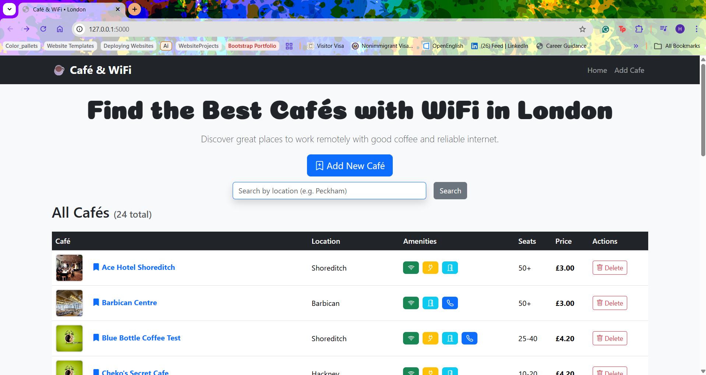

# ☕ Café & WiFi • London

A website built with **Flask**, **SQLAlchemy**, **Bootstrap 5**, and **WTForms** that displays, searches, adds, and deletes work-friendly cafés in London.

This is my **Day 88** project from Dr. Angela Yu's 100 Days of Code Python Bootcamp.

## ✨ Features

- **Responsive Bootstrap 5 Design** with modern cards and icons
- **Beautiful table** displaying all cafés with images, Google Maps links, and amenity badges (WiFi, Power Sockets, Toilet, Calls)
- **Search by location** (e.g. "Peckham", "Shoreditch", "Hackney")
- **Add new café** form with validation (WTForms)
- **Delete café** with confirmation dialog
- **Flash messages** for user feedback
- **Image error fallback** (shows a nice coffee image if a café photo fails to load)
- Fully connected to the existing `cafes.db` from Day 66

## 🛠️ Technologies Used

- **Full CRUD Operations**: Create (Add Café), Read (List + Search), and Delete functionality
- **Backend**: Flask + SQLAlchemy
- **Database**: SQLite (`cafes.db`)
- **Frontend**: Bootstrap 5 + Bootstrap Icons + Custom CSS
- **Forms**: Flask-WTF + WTForms (with CSRF protection)
- **Templating**: Jinja2
