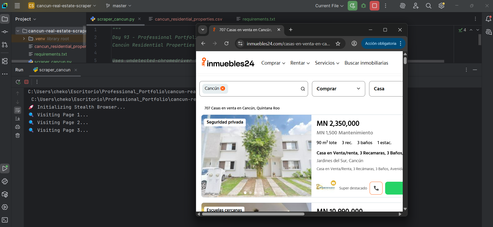

# Day 93: Cancún Real Estate Stealth Scraper

## 🎯 Project Objective
This is the **Day 93 Portfolio Project** of the "100 Days of Code" Python course. The goal is to build a professional-grade web scraper to gather and clean real estate data from a live, JavaScript-rendered website (**Inmuebles24**). This tool enables the creation of a structured dataset for market analysis, price trend monitoring, and investment research.

## 🛠️ Learning Outcomes & Technical Skills
* **WAF & Bot Bypass:** Utilized `undetected-chromedriver` to bypass Cloudflare "403 Forbidden" errors and JavaScript challenges.
* **Dynamic Scraping:** Implemented **Selenium** (Active Scraping) to render JS-heavy pages and **BeautifulSoup** (Parsing) for fast data extraction.
* **Advanced Data Cleaning:**
    * **Regex-based Normalization:** Stripping non-numeric symbols from price strings.
    * **Currency Heuristics:** Detecting USD vs MXN and applying conversion rates automatically.
    * **Pattern Filtering:** Keyword-based exclusion of commercial properties (Hotels, Lots, Bodegas).
    * **Deduplication:** Removing "Featured" listings that repeat across multiple pages.

## 🚀 Project Execution
The script initializes a patched Chrome instance (matching the local browser version) to mimic human behavior. It iterates through the search results, applying "human-like" delays between requests to ensure long-term reliability and avoid IP flagging.

### **Running Scraper Preview**

## ⚙️ Configuration Parameters
| Parameter | Value | Description |
| :--- | :--- | :--- |
| **Max Price** | $8,000,000 MXN | Filters out luxury properties outside the target range. |
| **USD Rate** | 18.5 | Conversion factor for listings posted in US Dollars. |
| **Max Pages** | 15 | Number of search result pages to process. |
| **Output** | `cancun_residential_properties.csv` | Final UTF-8-SIG encoded dataset. |

## 📂 Output Data Structure
The final CSV includes the following fields:
* `title`: The description or location block of the property.
* `price_mxn`: Cleaned numeric value (all converted to MXN).
* `url`: Full absolute link to the listing.
* `scraped_at`: Timestamp of the data collection.

---
*Developed as part of the 100 Days of Code: The Complete Python Pro Bootcamp.*