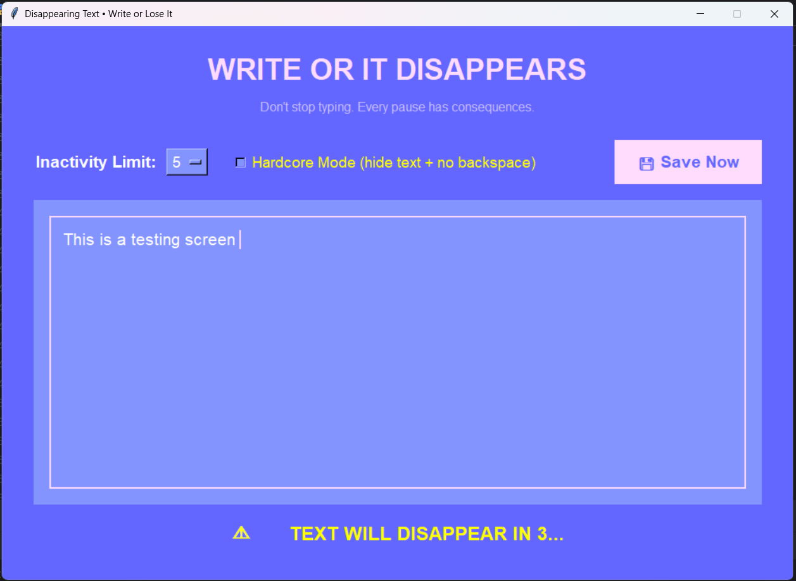

# Disappearing Text Writing App

A desktop implementation of **"The Most Dangerous Writing App"** built with Tkinter as part of **Day 90** of Dr. Angela Yu's 100 Days of Code Python Bootcamp.

## 🎯 Project Description

This application challenges writers to maintain continuous flow. If you stop typing for more than the selected inactivity period (5, 10, or 15 seconds), **all your text disappears instantly**.

It creates a high-pressure writing environment designed to overcome writer's block and build momentum through urgency.

## ✨ Features

- **Large, distraction-free text editor** with clean modern design
- **Configurable inactivity timer** (5, 10, or 15 seconds)
- **Real-time warning system** with countdown before deletion
- **Hardcore Mode** — hides the text while typing and disables backspace/delete/arrow keys
- **Manual Save button** — safely export your writing as a `.txt` file with timestamp
- **Fully commented**, professional-grade code with detailed explanations

## 🛠️ Technologies Used

- **Python** with **Tkinter** (built-in GUI library)
- `tkinter.messagebox` and `tkinter.filedialog` for user interactions
- `datetime` for timestamped file naming

