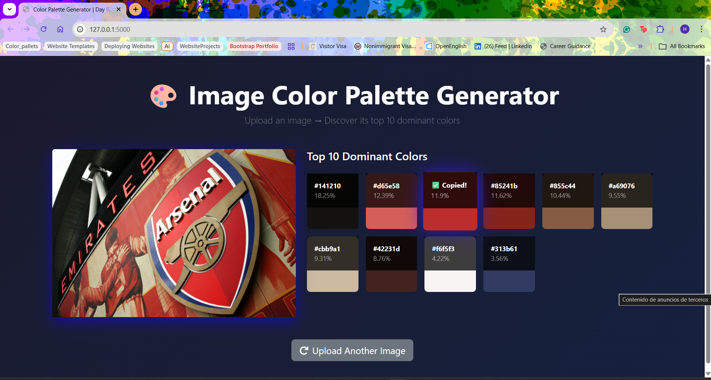

# 🎨 Image Color Palette Generator

A full-stack web application that leverages **Unsupervised Machine Learning** to extract dominant color palettes from images. Built as the capstone for **Day 92** of Dr. Angela Yu's 100 Days of Code Python Bootcamp.

## 🎯 Project Description

This application automates the process of color scheme extraction for designers and developers. Instead of manual sampling, the app utilizes a **K-Means Clustering algorithm** to analyze the pixel distribution of any uploaded image and identify the 10 most mathematically dominant colors.

The project demonstrates a modern **Hybrid Architecture**: 
*   **Python (Backend):** Handles heavy mathematical computation and machine learning logic.
*   **JavaScript (Frontend):** Provides a seamless, "Single Page App" experience with real-time UI updates and zero page refreshes.

## ✨ Features

- **Interactive Drag & Drop** — A custom-styled upload zone with real-time visual feedback using Bootstrap and JS event listeners.
- **K-Means Clustering** — Implements `scikit-learn` to group millions of pixels into distinct color "neighborhoods" based on RGB proximity.
- **Dynamic Asynchronous Pipeline** — Uses the JavaScript `fetch` API to communicate with Flask in the background, keeping the UI responsive.
- **Smart Image Preprocessing** — Automatic resizing via Pillow to optimize K-Means performance without losing color accuracy.
- **Interactive Color Swatches** — One-click copying of HEX codes using the `navigator.clipboard` API with "✅ Copied!" visual confirmation.
- **Secure File Handling** — Implementation of `secure_filename` and UUID prefixing to prevent file collisions and path traversal attacks.

## 🛠️ Technologies Used

### **Backend**
- **Python 3**
- **Flask**: Web framework and JSON API routing.
- **Scikit-Learn**: Implementing the `KMeans` machine learning model.
- **NumPy**: Matrix manipulation (reshaping 3D image arrays into 2D pixel tables).
- **Pillow (PIL)**: Image processing and `LANCZOS` resampling.
- **Werkzeug**: Security utilities for filename sanitization.

### **Frontend**
- **JavaScript (ES6+)**: Event-driven logic, DOM manipulation, and `async/await` fetch.
- **Bootstrap 5.3**: Responsive grid system and UI components (Spinners, Cards, Buttons).
- **FontAwesome**: Professional iconography for the interface.
- **CSS3**: Custom linear gradients, glassmorphism, and transform-based animations.

## 🧠 Pixels to Palette

1.  **Input (Pillow):** The image is loaded as a 3D object and resized to reduce mathematical load.
2.  **Translation (NumPy):** The 3D RGB "cube" is flattened into a 2D table of individual pixel observations.
3.  **Learning (K-Means):** The algorithm treats each pixel as a point in 3D space and clusters them into 10 neighborhoods.
4.  **Output (Flask/JS):** Centroids are converted to HEX, percentages are calculated, and the results are injected into the HTML.

