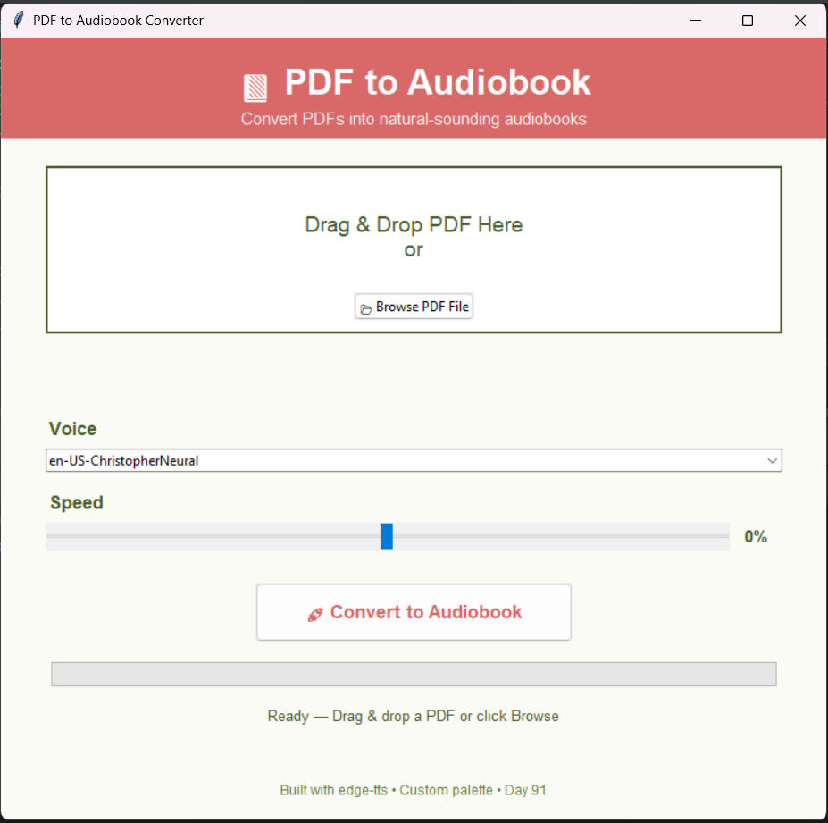

# PDF to Audiobook Converter

**Day 91** of [100 Days of Code](https://github.com/hapsolis/Professional_Portfolio) – Dr. Angela Yu's Python Bootcamp.

A Tkinter desktop app that converts any PDF into a high-quality MP3 audiobook using natural Microsoft neural voices (via `edge-tts`).

## ✨ Features
- Drag & drop or browse PDF files
- Smart text extraction with PyPDF2
- Chunked TTS processing for long documents
- Voice selection (multiple male/female neural voices)
- Adjustable speed (-50% to +50%)
- Real-time progress bar + detailed status updates
- Automatic smart MP3 naming with timestamp
- Professional UI with custom color palette

