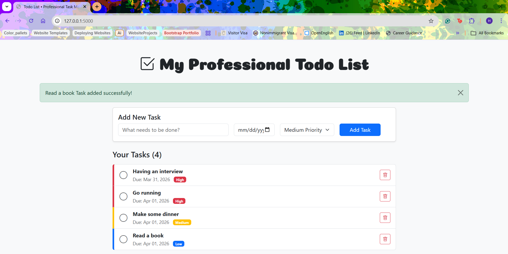

# 📝 Todo List Website - Day 89 | 100 Days of Code

A clean, modern, and fully functional **Task Manager** built with **Flask**, **SQLAlchemy**, **WTForms**, and **Bootstrap 5**.  

This project follows the same professional structure and educational commenting style as **Day 88 – Café & WiFi Website**. It demonstrates full **CRUD** operations with persistent SQLite storage, responsive design, priority-based sorting, due dates, and user-friendly flash messages.

## Features

- ➕ **Add new tasks** with optional due date and priority (Low / Medium / High)
- ✅ **Mark tasks as complete** (toggle with strikethrough and visual feedback)
- 🗑️ **Delete tasks** with confirmation prompt
- 📊 **Smart sorting**: High priority first, then by due date, then by date added
- 🎨 **Modern responsive UI** with Bootstrap 5 + custom CSS + Google Fonts (Coiny)
- 💾 **Persistent storage** using SQLAlchemy ORM + SQLite (`todos.db`)
- 🛡️ **Secure form handling** with WTForms (CSRF protection + validation)
- 📢 **Flash messages** for smooth user feedback (success, info, danger)
- 📱 **Fully mobile-friendly** design

## 🛠️ Technologies Used

- **Backend**: Python + Flask
- **Database**: SQLAlchemy + SQLite
- **Forms**: WTForms (with validators)
- **Frontend**: Bootstrap 5 + Bootstrap Icons + Custom CSS
- **Templating**: Jinja2

